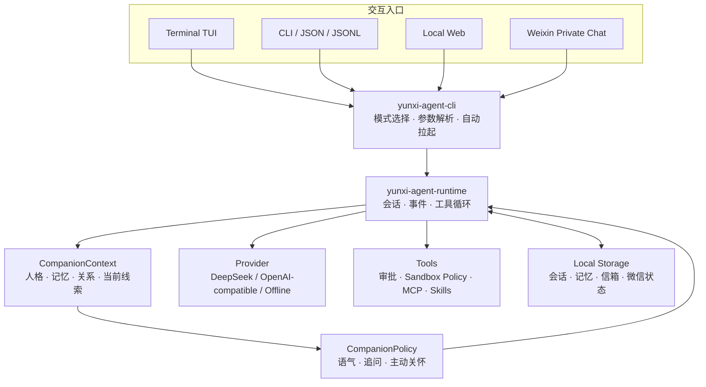
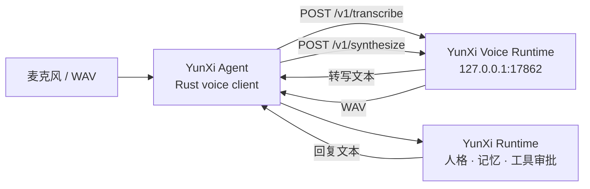

# YunXi Agent

<p align="center">
  
</p>

<p align="center">
  <strong>本地优先、可行动、会记得，也有稳定人格的中文陪伴型 Agent。</strong>
</p>

<p align="center">
  <a href="https://github.com/sjxbbdb/YunXi-Agent/tags"></a>
  
  
  
</p>

<p align="center">
  <a href="#项目概览">项目概览</a> ·
  <a href="#核心能力">核心能力</a> ·
  <a href="#快速开始">快速开始</a> ·
  <a href="#配置">配置</a> ·
  <a href="#5-可选本地语音闭环">本地语音</a> ·
  <a href="#使用方式">使用方式</a> ·
  <a href="#项目结构">项目结构</a> ·
  <a href="#常见问题">常见问题</a>
</p>

## 项目概览

YunXi Agent 不是只负责生成文本的聊天外壳。它把对话、工具调用、审批、人格与灵魂、长期记忆、陪伴策略、关系状态、情书信箱、微信接入和本地 Web 界面放进同一套 Rust Runtime，让不同入口共享同样的上下文、边界与行为。

项目坚持三个基本判断：

- **陪伴必须有连续性。** 人格、记忆与关系状态需要协同，而不是各自成为互不相干的功能开关。
- **行动必须可控。** 工具调用经过明确策略与审批，不因“陪伴”而绕过工作区、安全或隐私边界。
- **能力必须诚实。** 没有在线凭证时明确进入离线模式；失败、降级和未验证状态不会被包装成成功。

当前稳定版本为 `v2.3.3-hotfix.22`，主要支持 Windows 10/11 x64。默认 Runtime 由 YunXi 自有 crate 组成，不依赖外部 Codex CLI 进程；仓库中的 Codex 兼容层仅保留为独立、非默认的源码边界。

> [!NOTE]
> 默认人格开启；长期记忆、主动陪伴和情书生成默认关闭。YunXi 会在没有 Provider 凭证时使用带明确标记的离线 Runtime，不会伪造在线模型回复。

## 核心能力

| 能力 | 当前实现 |
| --- | --- |
| 对话与会话 | 交互式 TUI、普通 CLI、单轮命令、JSON/JSONL、会话恢复与上下文压缩 |
| 工具与审批 | Shell、补丁、MCP、Skills、多 Agent 工具路由，以及默认 `on-request` 审批 |
| 人格与灵魂 | 内置人格、可导入 profile、独立 soul 内容、价值观、称呼、语气和边界编译 |
| 长期记忆 | 全局与工作区作用域、候选审批、召回、搜索、失效链与 Relationship Graph Lite |
| 陪伴策略 | 规则优先的情绪线索、追问、主动关怀、安静时段、频率限制和自动降级 |
| 关系与信箱 | 从有效记忆派生关系阶段；按人格和记忆生成情书并写入本地加密信箱 |
| 微信接入 | 二维码登录、私聊接入、配对、远程审批、会话绑定、投递恢复和自动拉起 |
| 本地 Web | 聊天、记忆气泡、人格卡片、关系档案“她”和情书信箱，共享同一工作区状态 |
| 本地语音 | Rust 语音客户端连接独立的 [YunXi Voice Runtime](https://github.com/sjxbbdb/YunXi-Voice-Runtime) 私有 sidecar，使用 SenseVoiceSmall 输入与 CosyVoice 输出 |
| 工程验证 | 离线评估、CLI/TUI/微信回归、Windows ConPTY 证据、脱敏检查和完整发布门禁 |

### 多入口协同

CLI、TUI、Web 与微信不会各自维护一套人格或记忆。它们最终进入统一 Runtime，并共同使用 Persona、Companion、Memory、Storage、Tools 与 Provider 边界。



陪伴层默认使用确定性规则，不为普通回复额外增加一次模型调用。记忆抽取在 `auto` 模式下可能于成功回复后增加一次结构化 Provider 调用；失败时回退到本地规则，不应阻断主回复。

## 快速开始

### 环境要求

使用预编译包时：

- 64 位 Windows 10 或 Windows 11
- PowerShell 5.1 或 PowerShell 7
- 在线回复所需的 Provider API Key
- 可选：用于微信扫码确认的手机微信

从源码构建时还需要：

- Git
- Rust stable `1.85` 或更高版本（Rust 2024 edition）
- Cargo
- Visual Studio Build Tools 的 MSVC C++ 构建工具和 Windows SDK

可选本地语音还需要 NVIDIA GPU、兼容驱动、建议至少 `30 GB` 可用磁盘空间，以及由独立语音仓库安装脚本管理的 Python 3.10 环境。模型、Python 运行时和缓存不会写入 Rust 仓库或 Git。

### 方式一：安装预编译包

1. 在 [GitHub Releases](https://github.com/sjxbbdb/YunXi-Agent/releases) 下载与你需要的 tag 对应的 `windows-x64.zip`。
2. 解压后先阅读包内 `README.md`，并核对 `SHA256SUMS.txt` 与 `manifest.json`。
3. 在包根目录打开 PowerShell，安装到当前用户：

```powershell
Set-ExecutionPolicy -Scope Process Bypass
.\install.ps1 -AddToPath
```

重新打开终端后验证：

```powershell
yunxi --version
```

安装器只修改当前用户安装目录；升级时会先备份旧二进制。若对应 tag 暂未提供预编译资产，请使用下面的源码构建方式，不要从非项目来源下载可执行文件。

#### 便携运行

预编译包也支持不写 PATH 的便携模式：

```text
启动-YunXi.cmd
启动-Web端.cmd
```

便携模式把全局状态放在包内 `data\home`，工作区状态放在 `workspace\.yunxi`。使用后的包可能含有私人数据，不要重新压缩后转发。

### 方式二：从源码构建

```powershell
git clone https://github.com/sjxbbdb/YunXi-Agent.git
Set-Location .\YunXi-Agent
cargo build -p yunxi-agent-cli --release --bins
.\target\release\yunxi.exe --version
```

直接从构建目录启动：

```powershell
.\target\release\yunxi.exe
```

也可以安装到 Cargo 的用户级 bin 目录：

```powershell
cargo install --path .\crates\yunxi-agent-cli --locked
yunxi --version
```

### 方式三：交给 Agent 安装

仓库根目录提供正式的自动化安装协议：[agent.md](./agent.md)。它既覆盖 Release 包安装，也覆盖源码构建。

把仓库或解压后的发布包交给能够操作本机 PowerShell 的 Agent，然后发送：

```text
请先完整阅读 README.md，再阅读同目录的 agent.md；如果当前目录是源码仓库，还要先阅读 AGENTS.md。请严格按照 agent.md 完成环境检查、安装、基础配置和验证。不要读取、显示、记录或转述我的 API Key；需要密钥或微信扫码时暂停，让我亲自完成。不要覆盖未提交代码，不要删除既有配置、人格、记忆、信箱、会话或微信状态。
```

Agent 可以完成环境检查、完整性校验、构建、安装和离线验收，但以下动作仍应由用户本人完成：

1. 在自己的终端输入真实 API Key。
2. 使用手机完成微信二维码扫描和确认。

## 配置

### 1. 建立固定工作区

记忆、会话、关系和信箱具有工作区边界。建议长期使用独立目录：

```powershell
$YunXiWorkspace = Join-Path ([Environment]::GetFolderPath("MyDocuments")) "YunXi Workspace"
New-Item -ItemType Directory -Force -Path $YunXiWorkspace | Out-Null
```

不要把整个用户主目录、磁盘根目录或包含大量无关隐私文件的目录作为默认工作区。

### 2. 配置在线 Provider

DeepSeek 示例，只在当前 PowerShell 及其子进程中生效：

```powershell
$env:YUNXI_PROVIDER_PROFILE = "deepseek"
$env:DEEPSEEK_API_KEY = "<your-api-key>"
$env:YUNXI_AGENT_MODEL = "deepseek-v4-flash"
```

存在非空 `DEEPSEEK_API_KEY` 时，YunXi 也可以自动推断 DeepSeek profile。OpenAI-compatible 接口可通过 `YUNXI_PROVIDER_PROFILE`、`OPENAI_API_KEY`、`YUNXI_PROVIDER_BASE_URL` 和 `YUNXI_AGENT_MODEL` 配置。

不要把真实密钥写入 README、`agent.md`、截图、日志、Git 提交或聊天消息。没有凭证时可以显式离线运行：

```powershell
yunxi --offline --no-tui --cwd $YunXiWorkspace "本地自检"
```

### 3. 启用人格、记忆与陪伴

```powershell
yunxi persona on --cwd $YunXiWorkspace
yunxi memory on --cwd $YunXiWorkspace
yunxi companion on --cwd $YunXiWorkspace
```

检查状态：

```powershell
yunxi persona status --cwd $YunXiWorkspace
yunxi memory status --cwd $YunXiWorkspace
yunxi companion status --cwd $YunXiWorkspace
```

人格默认开启；记忆与主动陪伴默认关闭。情书生成同样默认关闭，因为它会使用私人关系与记忆内容。明确需要时可在当前会话启用：

```powershell
$env:YUNXI_LOVE_LETTERS_ENABLED = "1"
```

信箱内容使用本地加密存储。完整数据格式与边界见 [Companion Mailbox Protocol](docs/protocol/companion-mailbox.md)。

### 4. 可选：微信登录

```powershell
yunxi weixin login --cwd $YunXiWorkspace --account default
```

使用手机扫码并确认，然后检查：

```powershell
yunxi weixin status --cwd $YunXiWorkspace --account default
yunxi weixin doctor --cwd $YunXiWorkspace --account default
```

Token 与数据密钥通过 Windows Credential Manager 保存；工作区只保存非机密元数据和加密运行状态。交互式 CLI/TUI 与 Web 会按照现有登录状态尝试自动拉起默认微信网关；不需要时可传入 `--no-weixin-autostart`。

### 5. 可选：本地语音闭环

语音链保留 `SenseVoiceSmall + CosyVoice-300M-SFT` 作为永久稳定兜底，并可选升级为 `faster-whisper large-v3 + IndexTTS2`。它不是另一套聊天逻辑：无论使用哪组模型，转写文本都进入同一个 YunXi Runtime、Provider、人格、记忆、陪伴和工具审批链路，成功回复再合成为 WAV。

> [!IMPORTANT]
> 语音 sidecar 的独立部署仓库是 [sjxbbdb/YunXi-Voice-Runtime](https://github.com/sjxbbdb/YunXi-Voice-Runtime)。该仓库当前为 **Private**，克隆账户必须具有访问权限。`YunXi-Agent` 主仓库负责 Rust 客户端与 Agent 逻辑；语音仓库负责 Python 服务、模型安装与本地推理。

#### 仓库关联与依赖

| 仓库 | 负责内容 | 依赖关系 |
| --- | --- | --- |
| `YunXi-Agent` | 麦克风、VAD、播放、CLI/TUI、对话、人格、记忆、陪伴、工具与审批 | 可独立运行文字功能；启用语音时依赖 sidecar HTTP 服务 |
| `YunXi-Voice-Runtime` | 稳定/质量双链模型、本地 Python sidecar、隔离质量 worker、安装与启动脚本 | 不包含 Agent 逻辑；只向 YunXi Agent 提供 STT/TTS |

两者没有 Cargo、Python import、Git submodule 或共享状态目录依赖。运行时只通过本机回环 HTTP 连接：



主仓库的 `crates/yunxi-agent-voice` 是协议和客户端实现；`scripts/voice` 保留单仓集成测试快照。独立安装和部署以私有语音仓库 README 为准。

#### 需要下载的内容

语音仓库不提交模型和第三方运行产物。安装脚本会在指定的 `RuntimeRoot` 中下载：

- uv 管理的 Python 3.10 与独立 `venv`
- PyTorch `2.8.0+cu129`、torchaudio 和 STT/TTS 依赖
- `iic/SenseVoiceSmall`
- `iic/CosyVoice-300M-SFT`
- FunAudioLLM/CosyVoice 与 Matcha-TTS 源码
- uv、ModelScope 和 Hugging Face 缓存

质量链额外下载独立 Python 3.11 环境、`Systran/faster-whisper-large-v3`、固定 revision 的 `IndexTeam/IndexTTS-2`，以及固定 commit 的 IndexTTS2 官方源码。两套环境物理隔离，质量依赖不会覆盖稳定链。

#### 本地部署

先获取主仓库和已授权的私有语音仓库：

```powershell
git clone https://github.com/sjxbbdb/YunXi-Agent.git "D:\YunXi Agent"
gh repo clone sjxbbdb/YunXi-Voice-Runtime "D:\YunXi Voice Runtime Source"
```

安装 uv、Python 环境、依赖和模型：

```powershell
winget install -e --id astral-sh.uv
Set-ExecutionPolicy -Scope Process Bypass
Set-Location "D:\YunXi Voice Runtime Source"
.\install-voice-runtime.ps1 -RuntimeRoot "D:\YunXi Voice Runtime"
```

安装质量链时显式增加 `-IncludeQuality`；现有稳定模型不会被删除：

```powershell
.\install-voice-runtime.ps1 -RuntimeRoot "D:\YunXi Voice Runtime" -IncludeQuality
```

源码 checkout `D:\YunXi Voice Runtime Source` 与运行数据目录 `D:\YunXi Voice Runtime` 必须分开。后者包含模型、虚拟环境和缓存，不得加入 Git。

启动本地 sidecar：

```powershell
.\start-voice-runtime.ps1 -RuntimeRoot "D:\YunXi Voice Runtime"
```

默认模式仍是 `stable`。配置本机 VoiceProfile 后可启用质量模式或自动模式：

```powershell
.\start-voice-runtime.ps1 -RuntimeRoot "D:\YunXi Voice Runtime" -Mode quality `
  -VoiceProfile "D:\YunXi Voice Runtime\profiles\yunxi-primary\profile.json"

.\start-voice-runtime.ps1 -RuntimeRoot "D:\YunXi Voice Runtime" -Mode auto `
  -VoiceProfile "D:\YunXi Voice Runtime\profiles\yunxi-primary\profile.json"
```

质量 STT/TTS 的导入、缺文件、超时、空结果、无效 WAV 或推理错误只会回退当前语音端，不会重跑 Agent turn。连续质量故障会触发按端熔断；`voice doctor --json` 可查看 `mode`、`active`、`fallback`、`circuit_breaker` 和 `capabilities`。VoiceProfile 模板位于语音仓库的 `voice-profile.example.json`，参考音频、原文和生成文件只保存在被 Git 忽略的本机运行目录。

YunXi Agent 默认连接 `http://127.0.0.1:17862`，无需额外配置。另开 PowerShell 验证：

```powershell
Invoke-RestMethod http://127.0.0.1:17862/health
yunxi voice doctor
```

需要改端口时，sidecar 的 `-Port` 与客户端的 `YUNXI_VOICE_RUNTIME_URL` 必须一致：

```powershell
.\start-voice-runtime.ps1 -RuntimeRoot "D:\YunXi Voice Runtime" -Port 17863
$env:YUNXI_VOICE_RUNTIME_URL = "http://127.0.0.1:17863"
yunxi voice doctor
```

可选 `YUNXI_VOICE_AUTH_TOKEN` 必须在 sidecar 和 YunXi Agent 两端设置为相同值。默认只允许回环地址；连接非回环地址还必须显式设置 `YUNXI_VOICE_ALLOW_REMOTE=1`。

使用示例：

```powershell
yunxi voice devices
yunxi voice talk --companion
yunxi voice transcribe --input .\question.wav
yunxi voice speak "你好，我是 YunXi。" --output .\reply.wav
yunxi voice chat --input .\question.wav --output .\reply.wav --companion
```

在已经运行的交互式 CLI 或 TUI 中，直接使用内置语音模式：

```text
yunxi> /voice status
yunxi> /voice devices
yunxi> /voice
yunxi> /voice realtime on
yunxi> /voice realtime status
yunxi> /voice realtime off
```

`/voice` 会在当前文字会话中进入连续按键对讲：按 Enter 开始录音，再按 Enter 结束，输入 `q` 返回文字模式。识别文本直接进入当前 `InteractiveSession`，因此语音和文字共享同一条会话链、流式事件、人格、记忆、陪伴、工具和审批状态。

`/voice realtime on` 明确开启免按键半双工模式。VAD 会在内存中判断开始说话和尾部静音，自动完成一轮收音；回复会按自然短句分段，第一段合成后立即播放，并在播放当前段时预合成下一段。云熙播放完毕后继续监听。说“关闭实时语音”可以关麦并返回文字模式；TUI 中也可以输入 `q` 或 `/voice realtime off` 后按 Enter，或按 Ctrl+C 停止当前播放并立即关麦。`/voice realtime status` 查看状态。该开关默认关闭且不跨 CLI 会话保存，TUI 开启期间显示 `voice=live`。

`voice talk` 提供独立终端中的同类按键对讲。两种模式的录音都只保存在内存中，识别后进入同一套 YunXi Runtime，并在合成完成后通过默认扬声器播放。单次文件命令仍使用 WAV。

当前实时模式是 VAD 驱动的免按键半双工对话，不是全双工通话；支持键盘停止播放，但暂不支持用语音插话打断、流式 STT、服务端流式 TTS、音色克隆、JSONL 或语音直接批准工具。工具审批继续使用现有交互，语音内容不会自动放宽权限。

## 使用方式

### 交互式 TUI

```powershell
yunxi --cwd $YunXiWorkspace
```

真实终端中默认进入 TUI；管道、CI、JSON、JSONL 与单轮命令保持纯文本输出。需要稳定的普通 REPL 时：

```powershell
yunxi --no-tui --cwd $YunXiWorkspace
```

### 单轮任务

```powershell
yunxi --cwd $YunXiWorkspace "分析当前项目并给出下一步建议"
yunxi run --cwd $YunXiWorkspace "sessions 这个词作为普通提示处理"
```

`run` 适合提示文本与保留子命令重名的情况。

### 本地 Web

```powershell
yunxi web --cwd $YunXiWorkspace --bind 127.0.0.1 --port 17861
```

浏览器访问 [http://127.0.0.1:17861/](http://127.0.0.1:17861/)，健康检查地址为：

```powershell
Invoke-RestMethod http://127.0.0.1:17861/api/health
```

Web 默认仅绑定本机。除非已经配置防火墙、认证和可信网络，否则不要改为 `0.0.0.0` 或暴露到公网。

### 常用管理命令

```powershell
yunxi sessions list --cwd $YunXiWorkspace
yunxi persona list --cwd $YunXiWorkspace
yunxi memory pending --cwd $YunXiWorkspace
yunxi memory search --cwd $YunXiWorkspace "偏好"
yunxi companion history --cwd $YunXiWorkspace
yunxi controls status --cwd $YunXiWorkspace
```

查看所有参数：

```powershell
yunxi --help
yunxi <command> --help
```

## 数据与隐私

默认全局状态目录：

```text
%USERPROFILE%\.yunxi
```

可用 `YUNXI_HOME` 改写全局状态根目录。工作区内状态通常位于：

```text
<workspace>\.yunxi
```

主要数据边界：

- 人格 profile 与设置：全局 YunXi Home。
- 会话、工作区记忆、关系派生数据和信箱：当前工作区。
- 微信凭证与信箱系统密钥：Windows Credential Manager。
- 微信队列、绑定与投递恢复：工作区内的加密或脱敏状态。
- API Key：由环境变量或用户指定的安全入口提供，不应写入仓库。

长期记忆采用透明候选策略：低风险偏好和项目上下文可以自动写入；个人事实、关系记录、情绪、目标和中等敏感信息进入待审批；疑似密钥、密码和 Token 直接丢弃。记忆写入发生在成功回复之后，失败内容不会进入长期记忆。

## 设计与安全边界

- **Local-first：** 会话、记忆、人格、关系和信箱优先保存在本机。
- **One runtime：** CLI、TUI、Web、微信共享同一套 Runtime 和 Companion 决策。
- **Rule-first：** 陪伴层优先使用确定性规则，避免不必要的延迟和成本。
- **Fail-soft：** 人格、记忆或陪伴数据缺失时回退到基础回复链路。
- **Approval-first：** 工具调用默认按需审批，陪伴层不能降低审批级别。
- **Transparent memory：** 记忆可列出、搜索、审批、拒绝、删除和关闭。
- **Honest isolation：** `workspace-write` 是进程内策略约束；只有运行器明确报告 OS 隔离时才视为系统级沙箱。
- **Redacted diagnostics：** 普通输出不展示隐藏 prompt、完整记忆、Provider wire data、原始工具参数或秘密值。

## 项目结构

```text
YunXi-Agent/
├─ crates/                 YunXi 自有 Rust workspace
│  ├─ yunxi-agent-core/    公共类型、配置与 facade
│  ├─ yunxi-agent-runtime/ Agent 循环、事件、上下文与调度
│  ├─ yunxi-agent-provider/Provider 与流式传输
│  ├─ yunxi-agent-persona/ 人格、灵魂、记忆与关系模型
│  ├─ yunxi-agent-companion/陪伴策略、规划与情书任务
│  ├─ yunxi-agent-storage/ 会话、记忆、信箱和微信状态
│  ├─ yunxi-agent-tools/   工具路由与执行边界
│  ├─ yunxi-agent-tui/     终端交互与渲染
│  ├─ yunxi-agent-weixin/  微信登录、收发、配对与恢复
│  └─ yunxi-agent-cli/     yunxi 命令与内嵌 Web
├─ docs/                   架构、协议、设计、报告与证据
├─ evals/                  陪伴和微信离线评估场景
├─ scripts/                构建、安装与 ConPTY 验证脚本
├─ vendor/                 受治理的上游源码快照
├─ Cargo.toml              Rust 2024 workspace
├─ AGENTS.md               仓库开发约束
├─ agent.md                Agent 自动安装协议
└─ README.md               项目入口
```

更细的 crate 分层：

| 分层 | Crates |
| --- | --- |
| 公共契约 | `core`、`protocol`、`context` |
| 执行内核 | `runtime`、`provider`、`storage` |
| 陪伴系统 | `persona`、`companion`、`eval` |
| 工具系统 | `tools`、`sandbox`、`exec`、`patch`、`mcp`、`skills`、`multi-agent` |
| 交互入口 | `tui`、`weixin`、`cli` |

## 开发与验证

格式检查、全量测试和 Release 构建：

```powershell
cargo fmt --all -- --check
cargo check --workspace
cargo test --workspace
cargo build -p yunxi-agent-cli --release --bins
```

离线评估：

```powershell
cargo run -q -p yunxi-agent-cli --bin yunxi -- --json eval companion
cargo run -q -p yunxi-agent-cli --bin yunxi -- --json eval weixin
```

项目使用 Rust 2024。修改 Rust 后必须运行 `cargo fmt`，完成实现前必须运行与风险相匹配的测试；发布版本还需要 Release 构建、版本输出、脱敏检查和真实入口门禁。

## 文档导航

- [文档总索引](docs/README.md)
- [人格与透明记忆](docs/persona-memory.md)
- [微信接入边界](docs/weixin.md)
- [TUI 表现与终端生命周期](docs/tui-presentation.md)
- [Companion Mailbox Protocol](docs/protocol/companion-mailbox.md)
- [语音质量双链升级记录](docs/reports/development/2026-08-06-voice-quality-upgrade.md)
- [提取状态与能力边界](docs/extraction-status.md)
- [开发日志](docs/development-log.md)
- [报告与可复核证据](docs/reports/README.md)

## 常见问题

### 为什么没有在线回复？

YunXi 在自动模式下找不到有效凭证时会进入离线 Runtime，并打印明确警告。请只检查密钥是否存在，不要把值输出到屏幕：

```powershell
[bool](-not [string]::IsNullOrWhiteSpace($env:DEEPSEEK_API_KEY))
$env:YUNXI_PROVIDER_PROFILE
$env:YUNXI_AGENT_MODEL
```

### 为什么记忆存在但没有被召回？

记忆可能处于 pending、rejected、archived、invalidated 或 superseded 状态。使用：

```powershell
yunxi memory status --cwd $YunXiWorkspace
yunxi memory show --cwd $YunXiWorkspace <ID>
```

关注 `runtime_recallable` 与 `runtime_blockers`，不要只看存储层的 `active` 数量。

### Web 打不开怎么办？

```powershell
Get-NetTCPConnection -LocalPort 17861 -State Listen -ErrorAction SilentlyContinue
Invoke-RestMethod http://127.0.0.1:17861/api/health
```

端口被其他程序占用时改用 `--port 17862`，不要为了释放端口而批量终止名称相似的进程。

### 微信为什么没有自动拉起？

先执行 `weixin status` 和 `weixin doctor`。自动拉起要求默认账户已有可用登录元数据，并且启动时没有使用 `--no-weixin-autostart`。二维码登录与手机确认必须由用户本人完成。

### `yunxi` 命令找不到怎么办？

重新打开终端使用户 PATH 生效，或直接运行安装目录/构建目录中的 `yunxi.exe`。源码构建默认位于：

```text
target\release\yunxi.exe
```

## 版本与许可

- 当前版本：`v2.3.3-hotfix.22`
- 主要目标：`x86_64-pc-windows-msvc`
- Rust edition：`2024`
- Workspace license：`Apache-2.0`
- 历史版本与不可变 tag：[GitHub Tags](https://github.com/sjxbbdb/YunXi-Agent/tags)

第三方与 vendored 组件保留各自许可。发布包中的 `licenses/` 提供对应的项目许可与第三方声明。
